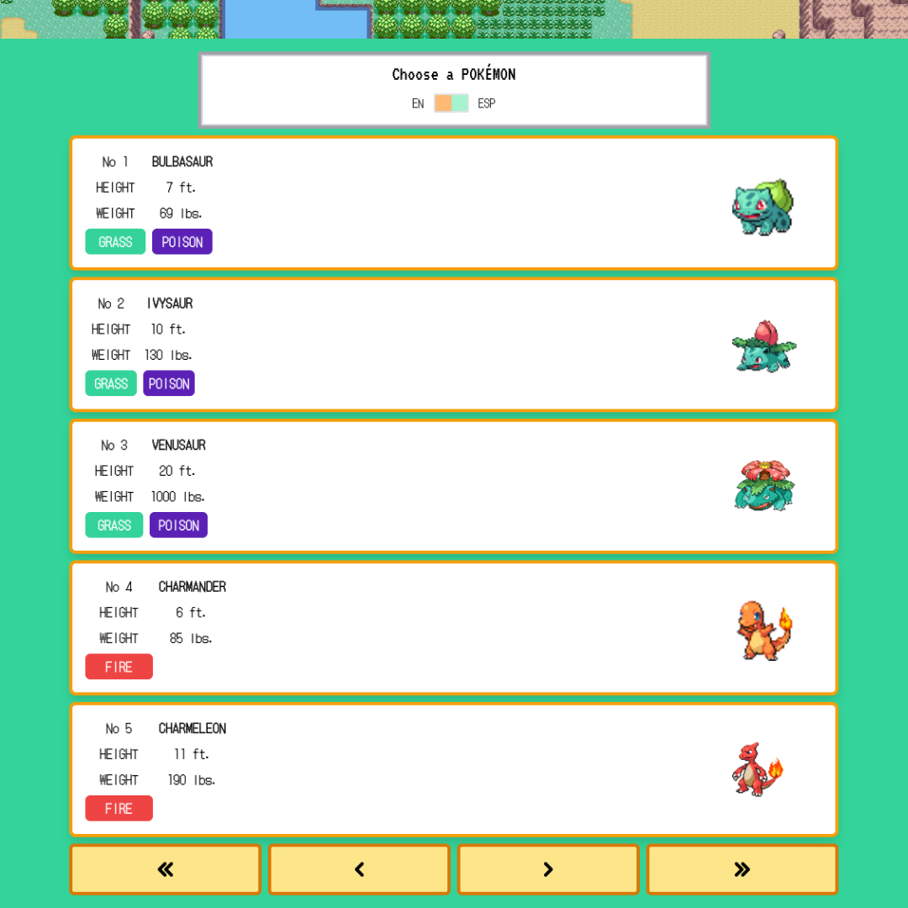
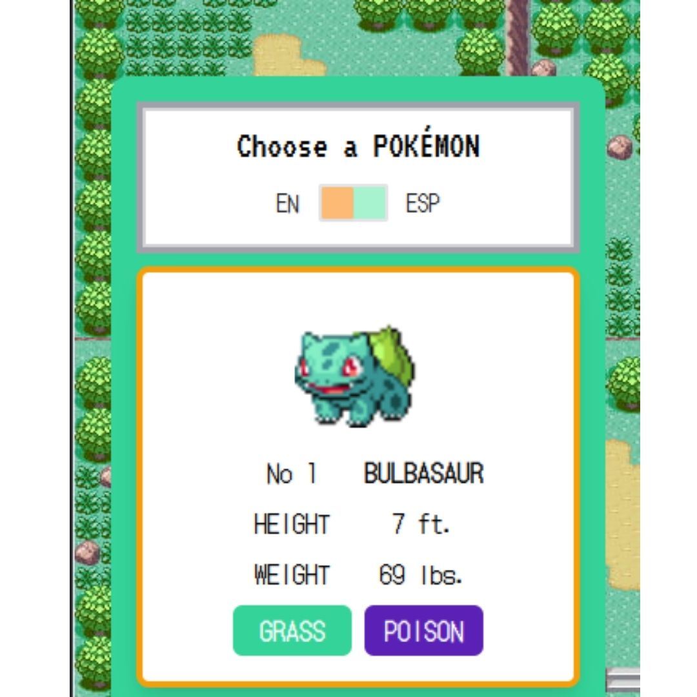
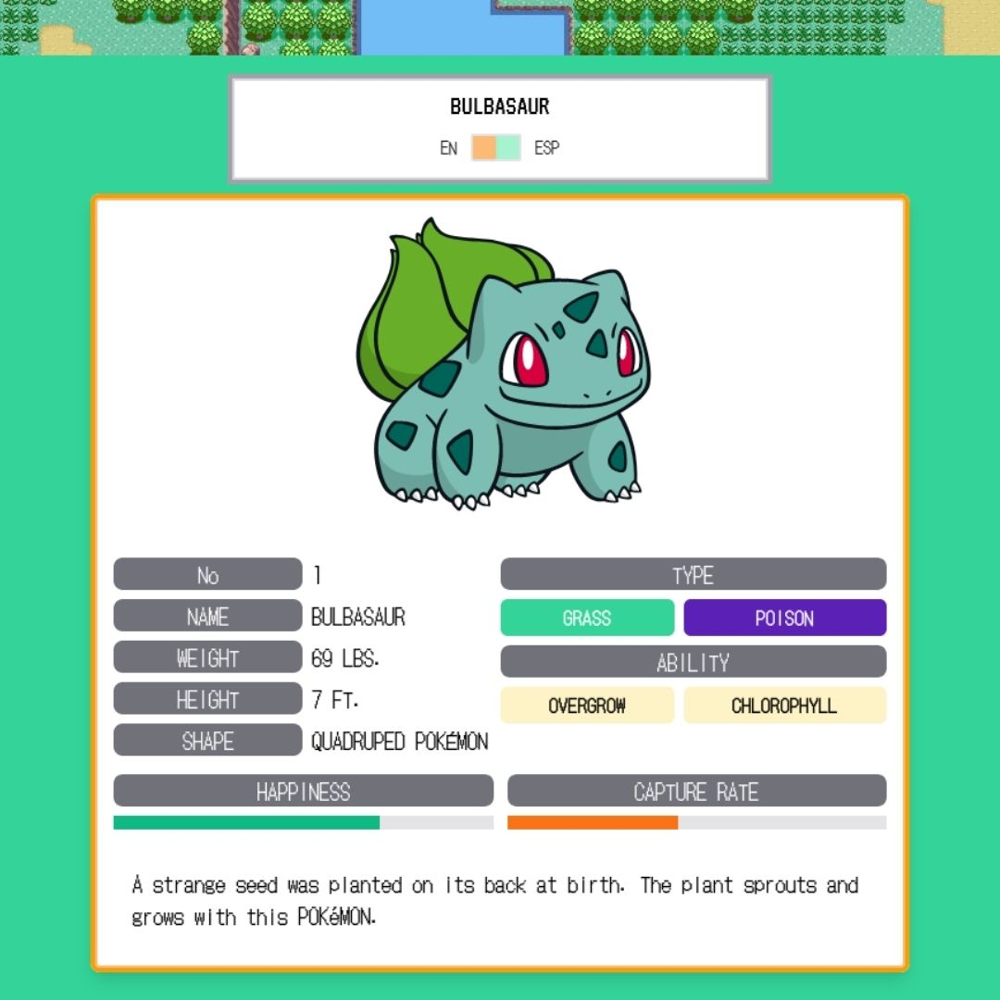
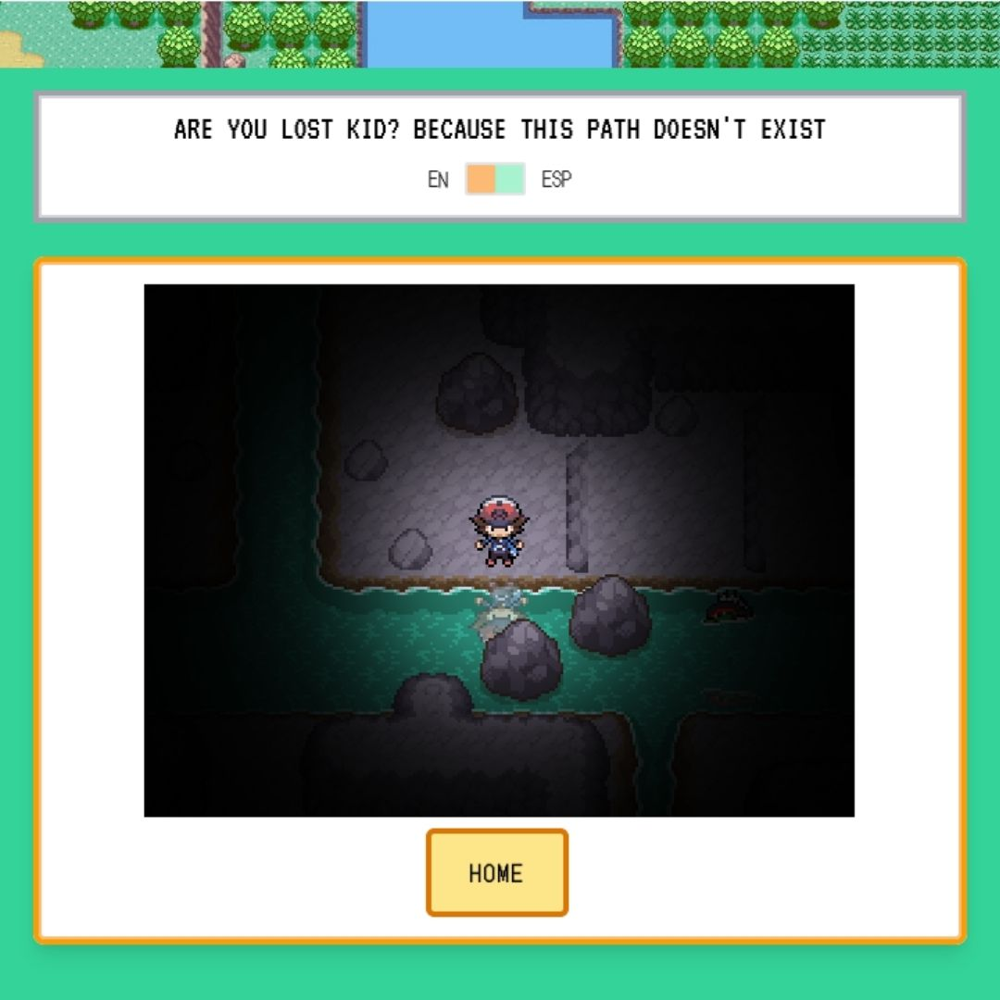

# PokeChallengeV2 App

This project consists of a SPA (Single Page Application) created with [Vue3](https://cli.vuejs.org/guide/creating-a-project.html) and TS (TypeScript), in addition [Vuex](https://vuex.vuejs.org/), [Vue Router](https://router.vuejs.org/guide/), the [Vue CLI](https://cli.vuejs.org/guide/installation.html) and Jest were used alongside this app.

Deployment link [link](https://pokechallengev2.web.app/) with [FirebaseCLI](https://firebase.google.com/docs/cli)

## Content

This proyecto has been developed and deployed as part of a technical challenge in which I had to develop a SPA with Vue3 and TS. To showcase my knowledge on REST API management I used the [PokeAPI](https://pokeapi.co/docs/v2#pokemon) as my database. This app has been heavily inspired in the GBA Pokemon videogames.

- SPA deployed with Vue3 on the FrontEnd.
- Vuex was used on the state managemnt.
- TailwindCSS as a CSS framework and website styles and responsiveness.
- Data fetching from PokeAPI, the pagination, details, descriptions, types and abilities.
- Unit testing with Jest and Vue test utils.
- Firebase to manage the deployment.
- GitFlow with [Semantic Commit](https://gist.github.com/joshbuchea/6f47e86d2510bce28f8e7f42ae84c716) for the git commands.

### Multimedia

<br />

#### Desktop



<br />

#### Mobile



<br />

#### Pokemon



<br />

#### English-Spanish Toggle


<br />

#### Routing NotFound



## Setup / Instalation

Clone this repo from `master` branch

Then execute on your terminal:

```
npm install
```

### Locally compile for development

```
npm run serve
```

### App compilation for produccion on `dist` folder

```
npm run build
```

### Run the tests

```
npm run test:unit
```

